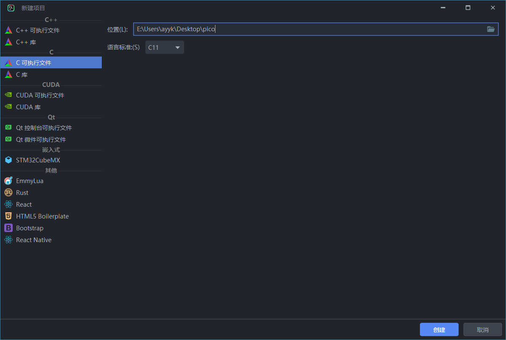
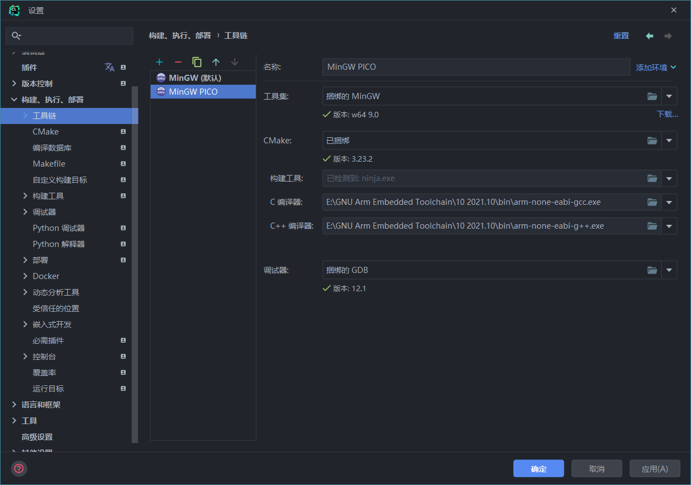
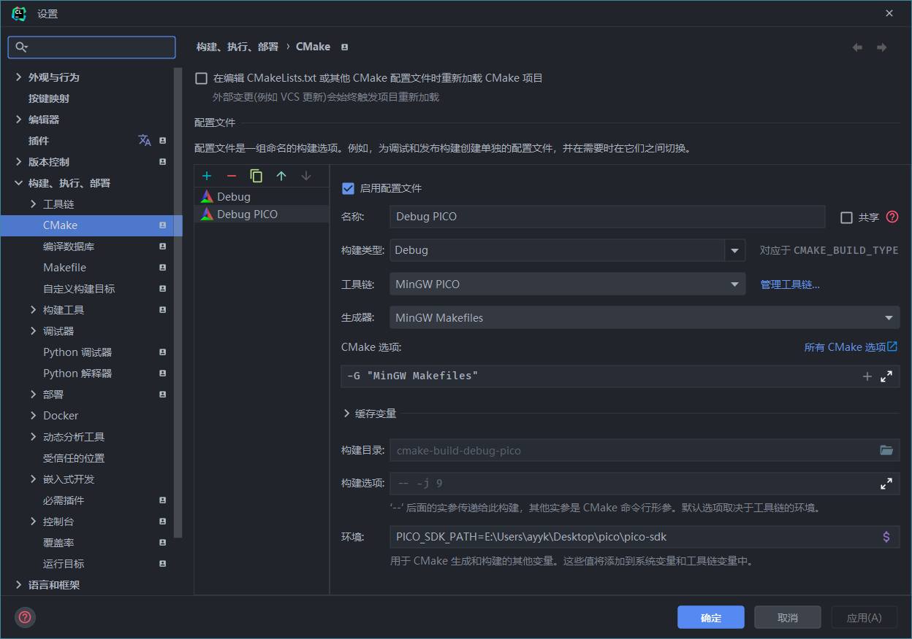
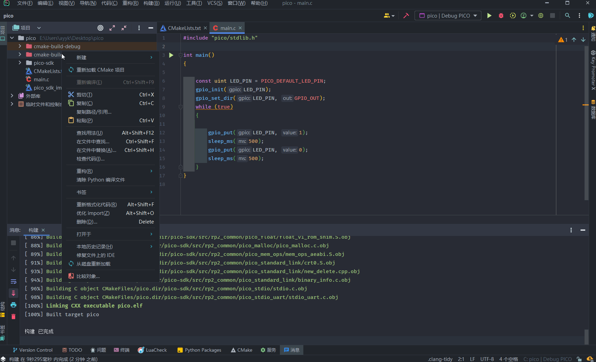
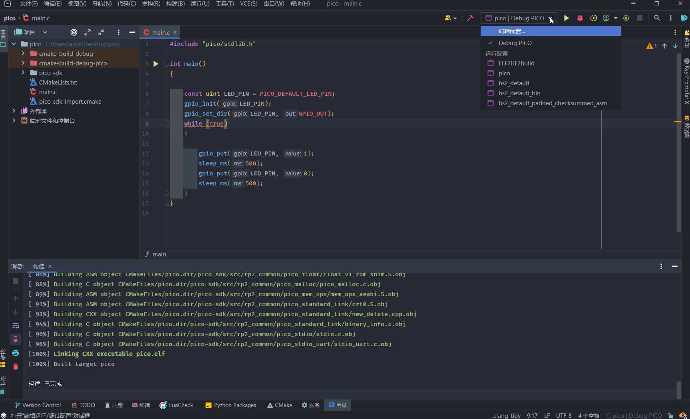
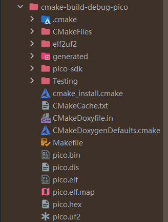

# pico_template

[TOC]

## 环境搭建

### 准备工作

- 下载安装交叉编译工具链  [ARM GNU](https://developer.arm.com/tools-and-software/open-source-software/developer-tools/gnu-toolchain/downloads)

    

- 下载树莓派[Pico SDK](https://github.com/raspberrypi/pico-sdk)

- 创建工程

    

> **MinGW工具链(含Cmake、Make、GDB)在2021版本的Clion中默认已经安装**

### 设置编译链接环境

#### 创建新的编译工具链



> - 创建一个新的 MinGW 工具链，重命名为 **MinGW PICO**
> - 选择**C Complier** 和 **C++ Complier** 为之前安装的ARM GNU工具链中的GCC和G++
> - Make与GDB保持不变

---



> - 选择 Cmake，修改 Cmake DEBUG配置，**Toolchain**选择之前创建的 **MinGW PICO**
> - **Generator**选择 **MinGW Makefile**
> - **配置PICO SDK的环境变量**
>     - 变量名为 **PICO_SDK_PATH**，值为之前解压的SDK的绝对路径（例如 `D:\pico\pico-sdk`）
> - **配置交叉编译工具链的环境变量**
>     - 变量名为 **PICO_TOOLCHAIN_PATH**

---

#### 修改CMakeLists.txt

- 将**pico-sdk** 中`pico_sdk_import.cmake` 文件，**复制到项目根目录**

- 修改 根目录下的`CMakeLists.txt`

    ```
    cmake_minimum_required(VERSION 3.23)
    
    # initialize the SDK based on PICO_SDK_PATH
    # note: this must happen before project()
    
    include(pico_sdk_import.cmake)
    
    project(pico C CXX ASM)
    
    set(CMAKE_C_STANDARD 11)
    
    # Initialize the SDK
    pico_sdk_init()
    
    add_executable(pico main.c)
    target_link_libraries(pico  pico_stdlib)
    
    # create map/bin/hex/uf2 file in addition to ELF.
    pico_add_extra_outputs(pico)
    ```

    - 在`project` 行前增加`include(pico_sdk_import.cmake)` 导入PICO的SDK
    - Project中增加 `CXX ASM`，这因为SDK需要使用C++和汇编
    - 初始化SDK`pico_sdk_init`
    - 可执行程序链接上`pico_stdlib`库
    - 添加额外输出`pico_add_extra_outputs`，用于生成PICO的可执行文件，否则只有DEBUG的`.efl`文件

    ---

    **删除原有**`cmake-build-debug-pico`文件夹，重新加载。重新加载后可以看见，项目目录中增加了`pico-sdk`



## 添加测试代码

进入`main.c` 文件编写LED闪烁的程序如下：

```c
#include "pico/stdlib.h"

int main()
{
    const uint LED_PIN = PICO_DEFAULT_LED_PIN;
    gpio_init(LED_PIN);
    gpio_set_dir(LED_PIN, GPIO_OUT);
    while (true)
    {
        gpio_put(LED_PIN, 1);
        sleep_ms(500);
        gpio_put(LED_PIN, 0);
        sleep_ms(500);
    }
}
```

编译过程：



在`cmake-build-debug-pico`目录中找到该可执行文件`pico.uf2`。

`pico.elf` 需要DEBUG调试启动



## 运行

- 先按住 PICO Pi 的**BOOTSEL**按键不放，然后插上USB

- 将编译生成的可执行文件`pico.uf2` 放入该磁盘中
- **若程序正常，复制成功后该磁盘将会断开连接，Pico Pi将会自动重启执行程序**
